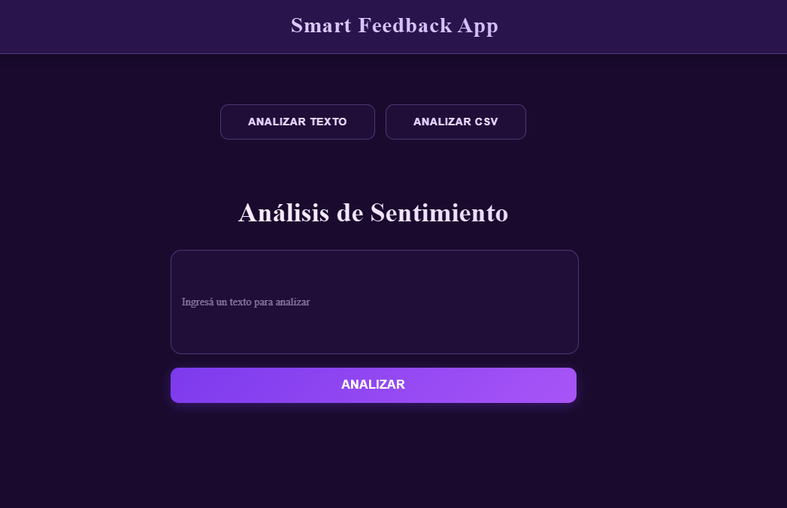
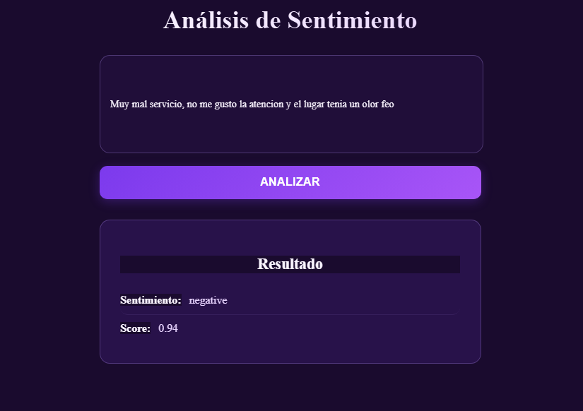
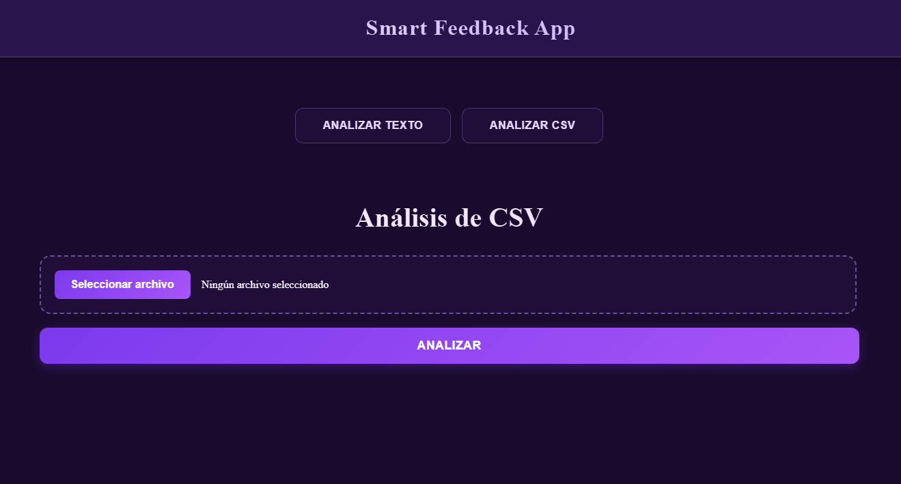
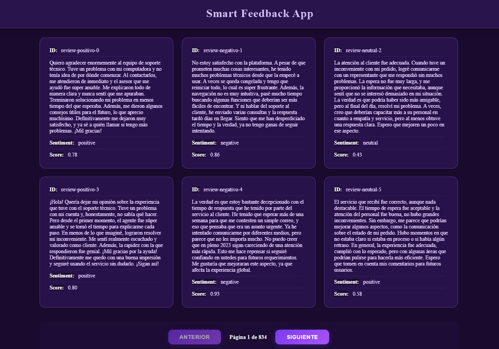

# The Smart Feedback API

##  Decisiones Técnicas

### Elección del modelo
Se utilizó un modelo basado en **RoBERTa** para el análisis de sentimiento debido a que:
- Es un modelo preentrenado (twitter) ampliamente utilizado en tareas de NLP.
- Presenta buen rendimiento en clasificación de texto sin necesidad de reentrenar.
- Permite obtener resultados confiables usando inferencia directa.
- Está disponible fácilmente a través de la librería `transformers` de Hugging Face.
---
### Modularizado

Las validaciones de archivos y estructura de CSV se separaron en un módulo `utils` para:

- Evitar lógica duplicada
- Mantener funciones pequeñas y reutilizables
- Mejorar la legibilidad del código principal

Esto para mantener el código más limpio y organizado.

---

### Uso de CSV como formato de entrada

Originalmente, el archivo reviews.csv que se me proporcionó parecía tener un propósito meramente ilustrativo. Por esta razón, decidí implementar una ruta que permita la carga de archivos CSV con múltiples mensajes para análisis. Esta decisión mejora la funcionalidad de la aplicación, ya que no solo permite analizar un mensaje aislado, sino que también facilita el análisis de múltiples mensajes a la vez, haciendo la aplicación más robusta y escalable.
La ruta devuelve los datos paginados junto con la cantidad de paginas y la cantidad de datos totales utilizando guardado de archivos temporales.

---

### Entorno virtual (`venv`)

Se utiliza un entorno virtual para manejar las dependencias del proyecto de forma aislada.
Esto evita problemas con librerías instaladas globalmente en la máquina.

El entorno virtual no forma parte del repositorio y debe crearse localmente.

---

## Iniciar el proyecto

Primero se recomienda crear un entorno virtual para aislar las dependencias del proyecto:
```bash
python -m venv venv
```

Activar el entorno virtual:

**En Windows:**
```bash
venv\Scripts\activate
```

**En Linux / Mac:**
```bash
source venv/bin/activate
```

Con el entorno virtual activo, instalar las dependencias necesarias:
```bash
pip install -r requirements.txt
```

Una vez instaladas las dependencias, levantar el servidor con Uvicorn:
```bash
uvicorn api.main:app --reload
```

La API quedará disponible en:
```
http://127.0.0.1:8000
```


# API de Análisis de Sentimiento

Este proyecto consiste en una API backend para análisis de sentimiento utilizando un modelo Transformer preentrenado y un frontend simple para facilitar las pruebas de la aplicación.

La API permite:
- Analizar el sentimiento de un texto individual
- Analizar múltiples textos a partir de un archivo CSV, con resultados paginados

---

## Extra: Frontend para pruebas

Como complemento al backend, desarrollé **un frontend simple** para poder probar la API de manera más cómoda y visual, sin depender únicamente de herramientas como Postman o Swagger.

Este frontend **no era un requisito**, pero lo agregué como extra para:
- Facilitar la validación del funcionamiento de la API
- Visualizar mejor los resultados
- Simular un posible uso real de la aplicación

---

##  Frontend

- Framework: **Angular**
- Propósito: interfaz de prueba para consumir los endpoints del backend
- Comunicación con el backend mediante HTTP (REST)

### Funcionalidades del frontend

- ✅ Análisis de texto individual
- ✅ Carga de archivo CSV
- ✅ Visualización de resultados en cards
- ✅ Paginación de resultados del CSV

---

## Análisis de Texto

### Sin resultado (estado inicial)

Pantalla inicial donde el usuario puede ingresar un texto para analizar:



### Con resultado

Luego de enviar el texto, se muestra:
- Sentimiento detectado
- Score de confianza



---

##  Análisis de CSV

### Sin resultado (estado inicial)

Pantalla para cargar un archivo CSV con múltiples mensajes:



### Con resultado

Luego de subir el archivo:
- Se muestran los resultados paginados
- Cada registro se presenta en una card con su análisis



---

## Estructura general del proyecto

- `api/` → Rutas de FastAPI
- `nlp/` → Lógica de análisis de sentimiento
- `utils/` → Validaciones de archivos y CSV
- `data/` → Archivos CSV de ejemplo
- `frontend/` → Aplicación Angular para pruebas

---

## Notas

- El frontend está pensado únicamente como herramienta de prueba y demostración.
- El backend puede utilizarse de forma independiente mediante HTTP.
- El análisis de CSV se realiza utilizando archivos temporales y los resultados se devuelven de forma paginada para evitar sobrecargar la respuesta.

---

## Link al repositorio del Frontend: 
    https://github.com/LucianoBDN/Smart_Feedback_App_Frontend